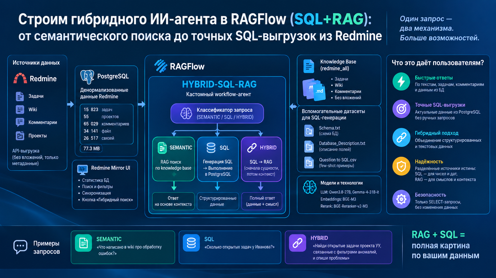
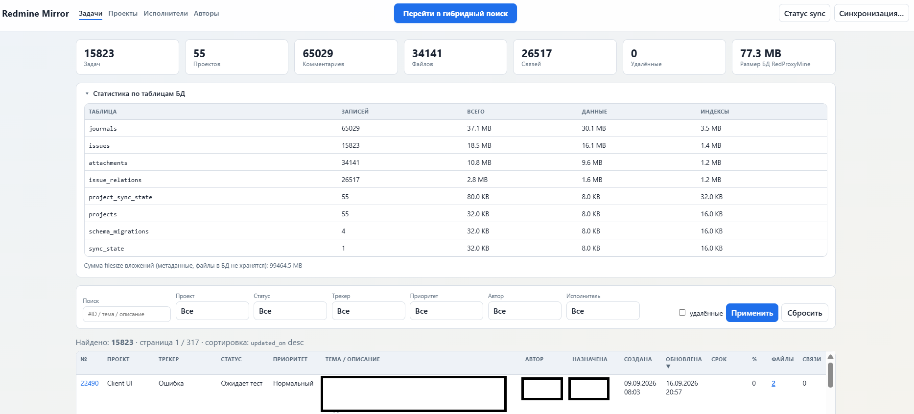
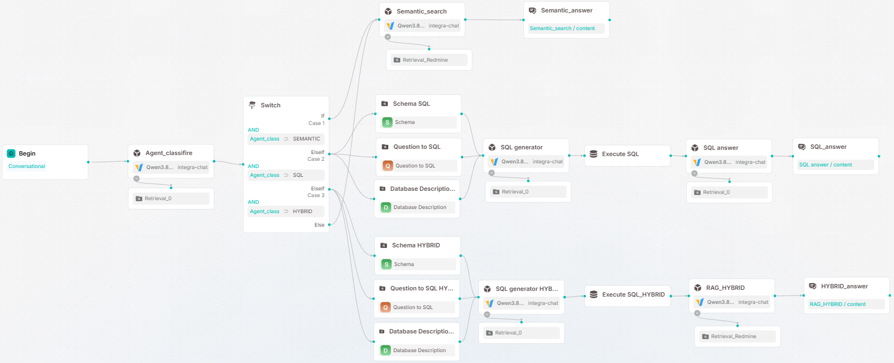

# Описание системы гибридного поиска HYBRID-SQL-RAG



## Архитектура системы

Система состоит из двух основных компонентов:

### 1. База данных PostgreSQL (http://192.168...)

**Назначение**: Хранение денормализованных данных из корпоративного Redmine

**Источник данных**: Выгрузка по **API** из корпоративного **Redmine** (все проекты: задачи + wiki + комментарии, без вложений, только метаданные)

**Интерфейс**: Веб-интерфейс `Redmine Mirror` доступен по адресу http://192.168...:80..

**Текущая статистика БД "RedProxyMine":**
- 15 823 задач (`issues`)
- 55 проектов (`projects`)
- 65 029 комментариев (`journals`)
- 34 141 файл (`attachments`)
- 26 517 связей между задачами (`issue_relations`)
- 0 удалённых записей
- 77.3 MB общий размер БД

**Основные таблицы:**
- `issues` - задачи (15 823 записей, 18.5 MB)
- `journals` - комментарии и история (65 029 записей, 37.1 MB)
- `attachments` - вложения (34 141 записей, 10.8 MB)
- `issue_relations` - связи между задачами (26 517 записей, 2.8 MB)
- `projects` - проекты (55 записей)
- `project_sync_state` - состояние синхронизации проектов

**Функциональность UI:**
- Общая статистика по БД
- Детальная статистика по таблицам (количество записей, размер данных и индексов)
- Полнотекстовый поиск по **ID**, теме и описанию задач
- Фильтрация по: проектам, статусам, трекерам, приоритетам, авторам, исполнителям
- Кнопка синхронизации с **Redmine**
- Кнопка перехода в гибридный поиск

Интерфейс



### 2. RAGFlow с агентом `HYBRID-SQL-RAG` (http://192.168...)

**Платформа:** `RAGFlow` (фреймворк для создания **RAG**-приложений)

**Модели** (Profile / Model Providers / vLLM):

**Embedding и Rerank:**

integra-embedding-reranker
- bge-m3 (эмбеддинги)
- bge-reranker-v2-m3 (реранкинг)
- URL: http://192.168...

**Chat:**

integra-chat:
- Qwen3.8-27B
- gemma-4-31B-it
- URL: https://ai...

**База знаний** (Dataset / redmine_all):

Все данные из **Redmine** выгружены в виде **Markdown**-файлов (`.md`) в единый датасет.

Структура именования файлов:

`{project_id}_{project_identifier}_{type}_{name_or_id}.{md}`

**Примеры:**
- `70_eilyacuarioclient3d_issues_issue_8369_d71a8091.md` - задача 8369 проекта 70
- `69_eilyacuario_wiki_Поиск_элементов_в_графе_9d101994.md` - wiki-страница проекта 69

**Содержимое:**
- Задачи (`issues`)
- Wiki-страницы
- Комментарии
- Без вложений (только текстовое содержимое)

**Вспомогательные датасеты для SQL-генерации:**

**Schema** (`Schema.txt`):
- Полная схема **PostgreSQL** базы данных
- Структура таблиц, поля, типы данных, индексы, внешние ключи

**Database Description** (`Database_Description.txt`)
- Описание денормализованной схемы
- Правила поиска и фильтрации
- Примеры использования полей

**Question to SQL** (`Question to SQL.csv`)
- Примеры вопросов на естественном языке
- Соответствующие **SQL**-запросы
- **Few-sho**t обучение для генератора **SQL**

### Агент HYBRID-SQL-RAG:

**Тип**: Кастомный workflow-агент

**Основа**: Модифицированная схема `SQL Assistant` (https://ragflow.io/blog/tutorial-building-a-sql-assistant-workflow)

**Полная конфигурация**: `HYBRID-SQL-RAG.json`

**Архитектура агента:**
```
Begin → Agent_classifier → Switch
                              ↓
            ┌─────────────────┼─────────────────┐
            ↓                 ↓                 ↓
        SEMANTIC            SQL              HYBRID
            ↓                 ↓                 ↓
    Semantic_search    SQL generator      SQL generator
            ↓                 ↓                 ↓
    Semantic_answer    Execute SQL        Execute SQL
                            ↓                 ↓
                    SQL answer          RAG_HYBRID
                            ↓                 ↓
                    SQL_answer          HYBRID_answer
```
**Схема агента**



**Компоненты:**

1. **Agent_classifier (EveryBreadsThink)**
- Классифицирует запрос пользователя
- Определяет режим обработки: SEMANTIC / SQL / HYBRID
- Temperature: 0.1, Max tokens: 64

2. **Switch (QuickWordsRest)**
- Маршрутизация по типу запроса
- Case 1: **SEMANTIC** → только семантический поиск
- Case 2: **SQL** → только SQL-запрос
- Case 3: **HYBRID** → SQL + семантический поиск

3. **SQL режим:**
- **Retrieval** (StrictMomentsWink, FiveCamerasWear, DarkGlassesFlash) - извлечение схемы, примеров и описания БД
- **SQL generator** (GreatTurkeysEnter) - генерация SQL-запроса на основе вопроса
- **Execute SQL** (FreshHatsProve) - выполнение запроса к PostgreSQL (192.168..., БД: `XXX`)
- SQL answer (SwiftTreesLick) - формирование ответа на основе результатов SQL

4. **HYBRID режим:**
- **Retrieval** (FluffyMammalsSink, NineRoomsSend, CleverCarsAccept) - извлечение контекста
- **SQL generator HYBRID** (YoungDragonsClean) - генерация SQL для определения сущностей
- **Execute SQL_HYBRID** (YummyLizardsSell) - выполнение SQL
- **RAG_HYBRID** (SmallJokesScream) - семантический поиск по найденным сущностям
- **HYBRID_answer** - финальный ответ

5. **SEMANTIC режим:**
- Semantic_search (OddDoorsHang) - поиск по базе знаний
- Semantic_answer - ответ на основе найденного контекста

**Интерфейс:** Встроенный UI RAGFlow (Management / Embed into webpage)

## Принцип работы

### SEMANTIC режим:

Используется для вопросов по текстовому содержимому:
- "Как настроить датчик XX?"
- "Какие фильтры аномалий применяются?"
- "Что написано в wiki про обработку ошибок?"
- Поток: `Вопрос → Retrieval из redmine_all → RAG → Ответ`

### SQL режим:

Используется для структурированных запросов:
- "Сколько открытых задач у Иванова?"
- "Какие задачи созданы на этой неделе?"
- "Показать последние 10 задач в проекте"
- Поток: `Вопрос → Retrieval схемы + примеров → SQL генерация → Выполнение → Форматирование → Ответ`

### HYBRID режим:

Используется для сложных запросов, требующих и структурированных данных, и текстового контента:
- "Какие открытые задачи проекта УУ связаны с фильтрами аномалий?"
- "Найди задачи Иванова по датчику XX и опиши проблемы"
- Поток: `Вопрос → SQL для определения сущностей → Retrieval по найденным ID → RAG → Ответ`

### Ключевые особенности

1. **Денормализованная схема БД** - все данные задач в одной таблице `issues` с полями `author_name`, `assignee_name`, `project_name` (без необходимости JOIN с таблицами `users` и `projects`)
2. **Три режима поиска** - интеллектуальная классификация запросов для выбора оптимального метода **Few-shot** обучение **SQL** - использование примеров из `Question to SQL.csv` для улучшения генерации запросов
3. **RAG + SQL комбинация** - возможность сначала найти сущности через **SQL**, затем получить текстовый контекст через семантический поиск
4. **Изоляция источников истины:**
- **SQL** - для чисел, дат, статусов, идентификаторов
- **RAG** - для описаний, комментариев, `wiki`-содержимого
5. **Безопасность** - только `SELECT`-запросы, запрет на модификацию данных

### Интеграция

**UI Redmine Mirror** (192.168...:80..) содержит кнопку "Перейти в гибридный поиск", которая ссылается на встроенный интерфейс агента `HYBRID-SQL-RAG` в **RAGFlow**.

**Технологии**
- **БД**: PostgreSQL 18.6
- **ETL**: Кастомная выгрузка из Redmine API
- **RAG-платформа**: RAGFlow
- **LLM**: Qwen3.8-27B, Gemma-4-31B-it
- **Embeddings**: BGE-M3
- **Rerank**: BGE-Reranker-v2-M3
- **Backend**: Python + Go
- **Frontend**: Встроенный UI RAGFlow + кастомный UI Redmine Mirror
